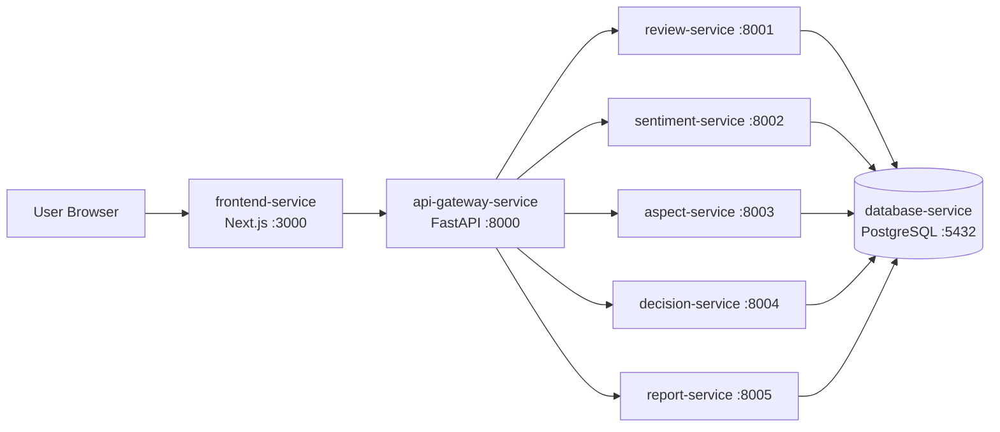
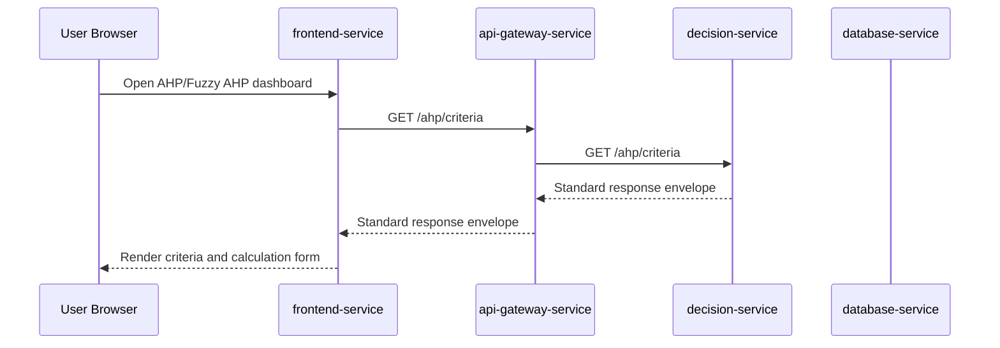

# SentiRank Microservice Architecture

## Purpose

This document defines the target microservice architecture for SentiRank, a thesis project for Spotify Google Play review analysis using IndoBERT, SVM, AHP, and Fuzzy AHP.

The goal is to align the backend architecture with the thesis claim of Microservice Architecture while preserving the current working implementation during an incremental transition.

## Current Architecture Assessment

The current backend is closer to a modular monolith than a full microservice system. Most backend and ML domains still live inside `ml-service`, with routers, services, schemas, scripts, notebooks, and utilities grouped in one runtime boundary.

This is not wrong. A modular monolith is a practical intermediate architecture for research systems because it keeps the codebase understandable while the ML and decision-support methods are still evolving. However, it is not sufficient to fully support a thesis claim that the system already uses Microservice Architecture.

The target architecture below separates SentiRank into independently deployable service boundaries with API-based communication and an API Gateway as the single frontend entry point.

## Target Architecture

| Service name | Responsibility | Port | Owner/domain | Current source of logic | Extraction priority |
| --- | --- | ---: | --- | --- | --- |
| `frontend-service` | Next.js user interface and dashboard views | 3000 | Presentation | `frontend/` | Existing service, keep separate |
| `api-gateway-service` | Public API entry point, CORS, response envelope, routing, health aggregation | 8000 | API Gateway | future extraction from frontend/backend integration layer | High |
| `review-service` | Dataset metadata, scraping summary, preprocessing summary, random review samples, EDA summary | 8001 | Review/data domain | `ml-service` scripts, outputs, and data summary logic | Medium |
| `sentiment-service` | IndoBERT sentiment inference, sentiment summary, sentiment evaluation | 8002 | Sentiment domain | `ml-service` sentiment router/service and IndoBERT artifacts | Medium |
| `aspect-service` | SVM aspect classification, aspect summary, aspect evaluation | 8003 | Aspect domain | `ml-service` aspect router/service and SVM artifacts | Medium |
| `decision-service` | AHP criteria, AHP calculation, Fuzzy AHP calculation, AHP/Fuzzy comparison | 8004 | Decision-support domain | `ml-service/app/routers/ahp.py`, AHP schemas, AHP services | First extraction |
| `report-service` | Report summary and consolidated evaluation summary aggregation | 8005 | Reporting domain | evaluation outputs and reporting notebooks/scripts | Low |
| `database-service` | PostgreSQL storage for thesis implementation | 5432 | Persistence | current SQLite/Prisma planning, future PostgreSQL container | Infrastructure |

## Service Dependency Flow

The frontend must call only the API Gateway. The API Gateway routes requests to internal services. Internal services can communicate over HTTP when a domain dependency is required.





## Service Responsibility Boundaries

### frontend-service

Owns user interface rendering, dashboard navigation, client-side state for UI interactions, and presentation components. It does not own ML logic, AHP/Fuzzy AHP calculation, direct internal service URLs, database access, or service orchestration.

### api-gateway-service

Owns the public API boundary. It handles CORS, route forwarding, response envelope standardization, public error mapping, and service health aggregation. It does not own domain calculations, ML inference, dataset transformation, or persistent domain data.

### review-service

Owns dataset-facing summaries and review retrieval. It exposes dataset, scraping, preprocessing, and random review sample endpoints. It does not own sentiment prediction, aspect classification, AHP/Fuzzy AHP calculation, or report-level interpretation.

### sentiment-service

Owns IndoBERT sentiment inference and sentiment evaluation summaries. The final candidate model is `run_3_weighted_loss_lr_1e-5`. It does not own aspect classification, review scraping, AHP/Fuzzy AHP calculation, or frontend rendering.

### aspect-service

Owns SVM aspect classification and aspect evaluation summaries. The final classifier is `merged_5class`. It does not own sentiment inference, AHP/Fuzzy AHP weighting, report aggregation, or frontend rendering.

### decision-service

Owns AHP criteria, AHP calculation, Fuzzy AHP calculation, and AHP/Fuzzy AHP comparison. This is the first extraction target because the AHP/Fuzzy AHP endpoints are already stable and FE-13 depends on them. It does not own ML inference, review data acquisition, report generation, or UI rendering.

### report-service

Owns high-level report and evaluation summary aggregation. It may call review, sentiment, aspect, and decision services through internal APIs. It does not own the underlying model inference or decision calculation implementations.

### database-service

Owns database runtime infrastructure. For thesis scope, one PostgreSQL container is sufficient. It does not own domain business logic.

## Communication Strategy

- External communication is browser to frontend, then frontend to API Gateway.
- Frontend uses `NEXT_PUBLIC_API_BASE_URL=http://localhost:8000`.
- Frontend must not know internal service ports.
- API Gateway communicates with internal services over HTTP REST.
- All services return the standard response envelope:

```json
{
  "success": true,
  "message": "...",
  "data": {}
}
```

## Docker and Network Strategy

The target deployment uses one Docker Compose network. Containers communicate by service name rather than localhost.

Example internal service URLs:

- `http://decision-service:8004`
- `http://review-service:8001`
- `http://sentiment-service:8002`
- `http://aspect-service:8003`
- `http://report-service:8005`

The API Gateway is the only backend service exposed to the frontend for API access.

## Database Strategy

For thesis implementation, a single PostgreSQL container is enough. Domain separation can be handled through schema or table ownership, for example review tables, sentiment tables, aspect tables, decision-support tables, and report tables.

This is acceptable for a thesis-stage microservice implementation because the architectural boundary is demonstrated through separate runtime services and API-based communication. Database-per-service can be a future improvement when operational complexity, independent scaling, and strict data ownership become necessary.

## Legacy Transition Strategy

`ml-service` can remain temporarily as the legacy modular backend while services are extracted incrementally.

Recommended extraction order:

1. Extract `decision-service` because AHP/Fuzzy AHP endpoints are stable and already used by the frontend demo flow.
2. Add `api-gateway-service` as the frontend-facing boundary.
3. Route FE-13 AHP/Fuzzy AHP calls through the gateway without changing frontend feature behavior.
4. Extract `review-service`, `sentiment-service`, and `aspect-service` from the existing `ml-service` modules.
5. Extract `report-service` after evaluation and reporting contracts stabilize.
6. Introduce `database-service` PostgreSQL after service contracts are stable.

## Why This Qualifies as Microservice Architecture

The target architecture qualifies as microservice architecture because it defines:

- independent deployable service boundaries
- separate runtime processes per domain
- API-based communication between services
- API Gateway as the single public entry point
- domain-based service separation
- Docker-based deployment topology
- internal services hidden from the frontend

The architecture is intentionally incremental so the current thesis implementation can evolve without breaking completed ML and frontend work.

## Limitations

This is a thesis-stage architecture plan. It does not yet implement all production-grade distributed system concerns.

Future work may include:

- authentication and authorization
- service discovery
- distributed tracing
- message broker or event-driven workflows
- database-per-service
- centralized logging
- circuit breakers and retry policies
- production secret management
- horizontal autoscaling

These are valid future improvements but are not required for the current thesis-stage microservice refactor.
