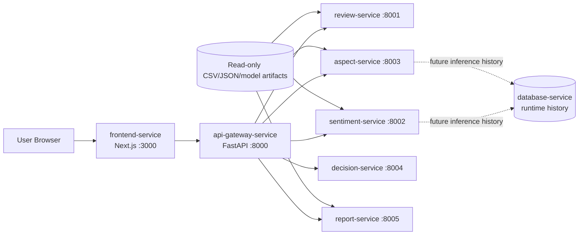
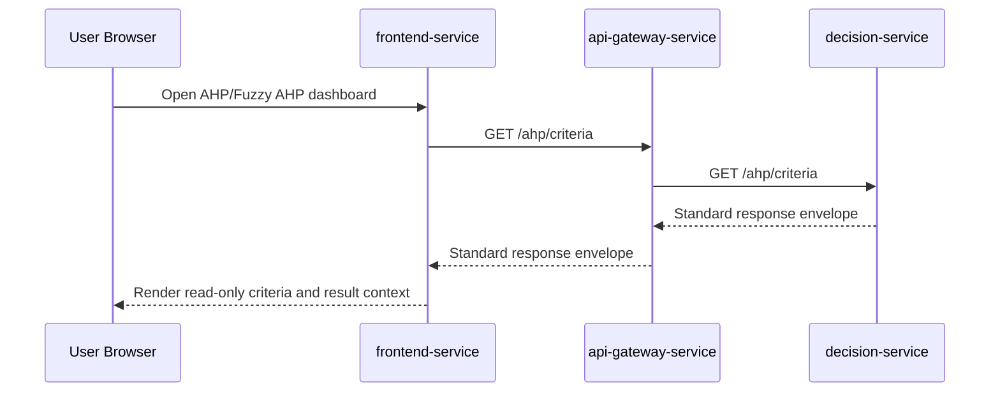

# SentiRank Microservice Architecture

## Purpose

This document defines the target microservice architecture for SentiRank, a thesis project for Spotify Google Play review analysis using IndoBERT, SVM, AHP, and Fuzzy AHP.

The goal is to align the backend architecture with the thesis claim of Microservice Architecture while preserving the current working implementation during an incremental transition.

## Current Architecture Assessment

The current backend is closer to a modular monolith than a full microservice system. Most backend and ML domains still live inside `ml-service`, with routers, services, schemas, scripts, notebooks, and utilities grouped in one runtime boundary.

This is not wrong. A modular monolith is a practical intermediate architecture for research systems because it keeps the codebase understandable while the ML and decision-support methods are still evolving. However, it is not sufficient to fully support a thesis claim that the system already uses Microservice Architecture.

The target architecture below separates SentiRank into independently deployable service boundaries with API-based communication and an API Gateway as the single frontend entry point.

## Data Source Policy

SentiRank uses two separate data paths. This distinction is intentional and must be preserved during the thesis-stage microservice refactor.

### Research Artifact Path

CSV, JSON, model, and report snapshot artifacts are allowed for reproducible research outputs, including:

- scraped review datasets
- preprocessing batch outputs
- labeling outputs
- SVM and IndoBERT evaluation metrics
- model evaluation summaries
- AHP outputs
- Fuzzy AHP outputs
- ranking comparison outputs
- dashboard or report snapshots derived from research outputs

These artifacts are read-only for runtime services, reproducible outputs from the thesis experiment pipeline, and versioned as research evidence. They are not interactive user runtime data and do not need to be migrated wholesale into the database for this milestone.

### Runtime Database Path

The database is reserved for user-facing runtime data, especially:

- user-submitted review text
- sentiment inference result
- aspect or criteria classification result
- confidence or probability values when available
- model version used for inference
- prediction source
- `created_at` timestamp
- inference history

As of MS-12A, `api-gateway-service` exposes runtime review inference endpoints that call `sentiment-service` and `aspect-service`, then persist the combined result to the runtime database. The database remains an inference-history store only, not the source of truth for research CSV/JSON artifacts.

### Frontend Data Access

The frontend must call only `api-gateway-service` through `NEXT_PUBLIC_API_BASE_URL`. Frontend code must not read CSV/JSON artifacts directly, call internal service ports `8001` through `8005`, or calculate AHP/Fuzzy AHP locally. It displays only data returned by gateway-backed services and explicit unavailable or empty states when the gateway is unavailable.

### Acceptable File-Based Runtime Reads

Some backend services may read CSV/JSON artifacts during runtime for demo, report, and thesis-result presentation as long as all of the following remain true:

- files are treated as read-only research artifacts
- ownership is clear by service domain
- frontend does not read files directly
- API Gateway remains the frontend entry point
- the service does not present static artifact data as live user-generated runtime data

This policy avoids unnecessary database migration while keeping the architecture academically defensible: reproducible research evidence stays artifact-based, while interactive user runtime data belongs in the database.

## Target Architecture

| Service name | Responsibility | Port | Owner/domain | Current source of logic | Extraction priority |
| --- | --- | ---: | --- | --- | --- |
| `frontend-service` | Next.js user interface and dashboard views | 3000 | Presentation | `frontend/` | Existing service, keep separate |
| `api-gateway-service` | Public API entry point, CORS, response envelope, routing, health aggregation | 8000 | API Gateway | future extraction from frontend/backend integration layer | High |
| `review-service` | Review dataset metadata, scraping summaries, preprocessing summaries, review samples | 8001 | Review/data domain | `datasets/raw`, `datasets/processed`, `datasets/outputs/eda/01_data_acquisition`, `datasets/outputs/eda/02_preprocessing` | Extracted |
| `sentiment-service` | Sentiment model metadata, sentiment summaries, sentiment evaluation, sentiment inference behavior | 8002 | Sentiment domain | `datasets/outputs/eda/03_indobert`, `datasets/outputs/eda/05_evaluation`, optional IndoBERT artifact mount | Extracted |
| `aspect-service` | Aspect classification metadata, aspect summaries, aspect evaluation, aspect inference behavior | 8003 | Aspect domain | `datasets/outputs/eda/04_svm`, `datasets/outputs/eda/05_evaluation`, optional SVM artifact mount | Extracted |
| `decision-service` | AHP, Fuzzy AHP, criteria, expert judgement processing, weighting, ranking comparison calculations | 8004 | Decision-support domain | service-owned schemas and calculation modules | Extracted |
| `report-service` | Read-only aggregation for Dashboard, evaluation, and ranking-comparison views | 8005 | Reporting domain | research output summaries across `datasets/outputs/eda` | Extracted / kept in MS-13D |
| `database-service` | Runtime persistence for user inference history | 5432 | Persistence | thesis-stage runtime history storage; not a research artifact warehouse | Infrastructure |

## Service Dependency Flow

The frontend must call only the API Gateway. The API Gateway routes requests to internal services. Internal services can communicate over HTTP when a domain dependency is required. Research artifacts are mounted or read behind service ownership boundaries; they are not frontend data sources.





## Service Responsibility Boundaries

### frontend-service

Owns user interface rendering, dashboard navigation, client-side state for UI interactions, and presentation components. It must use `NEXT_PUBLIC_API_BASE_URL` for browser-facing API access and may use `API_GATEWAY_INTERNAL_URL` only for server-side/Docker gateway routing. It does not own ML logic, AHP/Fuzzy AHP calculation, direct internal service URLs, CSV/JSON file reads, database access, or service orchestration.

### api-gateway-service

Owns the public API boundary. It handles CORS, route forwarding, response envelope standardization, public error mapping, service health aggregation, and runtime review inference orchestration. For runtime review inference, it calls `sentiment-service` and `aspect-service`, persists the combined result, and returns the saved history record. It does not own domain model calculations, dataset transformation, research artifact parsing, frontend rendering, or bulk research artifact persistence.

### review-service

Owns review dataset metadata, scraping summaries, preprocessing summaries, and review samples. It may read review-domain CSV/JSON artifacts from `datasets/raw`, `datasets/processed`, and early EDA outputs as read-only research evidence. It does not own sentiment prediction, aspect classification, AHP/Fuzzy AHP calculation, or report-level interpretation.

### sentiment-service

Owns sentiment model metadata, sentiment summaries, sentiment evaluation, and sentiment inference behavior. The final candidate model is `run_3_weighted_loss_lr_1e-5`. It may read sentiment evaluation JSON artifacts and optional IndoBERT model artifacts as read-only inputs. It does not own aspect classification, review scraping, AHP/Fuzzy AHP calculation, or frontend rendering.

### aspect-service

Owns aspect classification metadata, aspect summaries, aspect evaluation, and aspect inference behavior. The final classifier is `merged_5class`. It may read SVM/aspect CSV/JSON artifacts and optional SVM model artifacts as read-only inputs. It does not own sentiment inference, AHP/Fuzzy AHP weighting, report aggregation, or frontend rendering.

### decision-service

Owns AHP, Fuzzy AHP, criteria, expert judgement processing, weighting, and ranking comparison calculation behavior. It should own future validated expert judgement processing endpoints. It does not own ML inference, review data acquisition, report generation, frontend rendering, or direct frontend access.

### report-service

Owns read-only aggregation for Dashboard, evaluation, and ranking-comparison views. It may read consolidated research output CSV/JSON artifacts and may call review, sentiment, aspect, and decision services through internal APIs when needed. It does not own the underlying model inference, review acquisition, decision calculation implementations, frontend Reports routing, or printable report/export features.

MS-13D decision: keep `report-service` as an active dashboard aggregation service. The removed frontend Reports page/menu does not make this backend service obsolete because Dashboard, Model Evaluation, and AHP/Fuzzy AHP still consume API Gateway routes backed by `report-service`, especially `GET /evaluation/summary` and `GET /reports/ranking-comparison`.

### database-service

Owns runtime persistence for user inference history in the thesis-stage implementation. It is not required to store every research CSV/JSON artifact. It does not own domain business logic, static research outputs, or frontend-facing read models.

## Communication Strategy

- External communication is browser to frontend, then frontend to API Gateway.
- Frontend uses `NEXT_PUBLIC_API_BASE_URL=http://localhost:8000`.
- Frontend must not know internal service ports.
- API Gateway communicates with internal services over HTTP REST.
- All services return the standard response envelope:

```json
{
  "success": true,
  "message": "...",
  "data": {}
}
```

## Docker and Network Strategy

The target deployment uses one Docker Compose network. Containers communicate by service name rather than localhost.

Example internal service URLs:

- `http://decision-service:8004`
- `http://review-service:8001`
- `http://sentiment-service:8002`
- `http://aspect-service:8003`
- `http://report-service:8005`

The API Gateway is the only backend service exposed to the frontend for API access.

## Database Strategy

The database is for runtime user inference history, not for bulk research artifact migration. Acceptable runtime records include user-submitted text, sentiment result, aspect/criteria result, confidence/probability, model version, prediction source, timestamp, and inference history.

For the thesis-stage implementation, one shared database-service is sufficient if runtime persistence is needed. Domain separation can be handled through schema or table ownership. Database-per-service is future work, not a requirement for MS-10C.

MS-13E removed the legacy Prisma schema/config artifacts. Runtime inference history remains implemented by `api-gateway-service` repository persistence with SQLite local/demo fallback and optional PostgreSQL deployment. Do not interpret the Compose PostgreSQL service as a requirement to migrate all CSV/JSON research outputs into relational tables.

## Legacy Transition Strategy

`ml-service` can remain temporarily as the legacy modular backend while services are extracted incrementally.

Recommended extraction order:

1. Extract `decision-service` because AHP/Fuzzy AHP endpoints are stable and already used by the frontend demo flow.
2. Add `api-gateway-service` as the frontend-facing boundary.
3. Route FE-13 AHP/Fuzzy AHP calls through the gateway without changing frontend feature behavior.
4. Extract `review-service`, `sentiment-service`, and `aspect-service` from the existing `ml-service` modules.
5. Extract `report-service` after evaluation and reporting contracts stabilize.
6. Wire runtime inference history persistence after service contracts are stable; do not migrate research CSV/JSON artifacts wholesale. MS-12A implements this for user-submitted review inference through `api-gateway-service`.

## Current Runtime Audit

The MS-10C audit found the following current behavior:

- `review-service` reads CSV/JSON artifacts from `datasets/raw`, `datasets/processed`, and `datasets/outputs/eda/01_data_acquisition` plus `02_preprocessing`.
- `sentiment-service` reads JSON artifacts from `datasets/outputs/eda/03_indobert`, `datasets/outputs/eda/05_evaluation`, and sentiment distribution outputs.
- `aspect-service` reads JSON and CSV artifacts from `datasets/outputs/eda/04_svm` and `datasets/outputs/eda/05_evaluation`.
- `report-service` reads JSON and CSV artifacts across `03_indobert`, `04_svm`, `05_evaluation`, `06_ahp`, `07_fuzzy_ahp`, and `08_ranking_comparison`.
- `decision-service` currently owns calculation behavior and static criteria in code; it does not read research CSV/JSON artifacts.
- `api-gateway-service` proxies to internal services and does not parse research artifacts directly.
- `frontend-service` calls gateway routes through `NEXT_PUBLIC_API_BASE_URL`/`API_GATEWAY_INTERNAL_URL` and no direct frontend calls to internal ports `8001` through `8005` were found.
- Database runtime inference history is active for `POST /inference/review` and `GET /inference/history` through `api-gateway-service`; research CSV/JSON artifacts remain file-based.

Risk note: multiple extracted services currently depend on the shared `datasets/` artifact folder. This is acceptable for the thesis-stage reporting/demo scope because mounts are read-only and ownership is documented, but stronger domain-owned artifact packaging should be considered before claiming production-grade maturity.

## Why This Qualifies as Microservice Architecture

The target architecture qualifies as microservice architecture because it defines:

- independent deployable service boundaries
- separate runtime processes per domain
- API-based communication between services
- API Gateway as the single public entry point
- domain-based service separation
- Docker-based deployment topology
- internal services hidden from the frontend

The architecture is intentionally incremental so the current thesis implementation can evolve without breaking completed ML and frontend work.

## Limitations

This is a thesis-stage architecture plan. It does not yet implement all production-grade distributed system concerns.

Future work may include:

- authentication and authorization
- service discovery
- distributed tracing
- message broker or event-driven workflows
- migrating selected research summaries into PostgreSQL only when query patterns justify it
- stronger schema/domain ownership for runtime persistence
- database-per-service
- migration and seed pipeline for final thesis demo data
- inference history endpoint for user-submitted reviews
- centralized logging
- circuit breakers and retry policies
- production secret management
- horizontal autoscaling

These are valid future improvements but are not required for the current thesis-stage microservice refactor.
