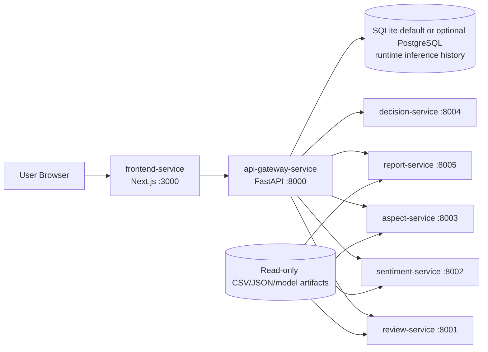
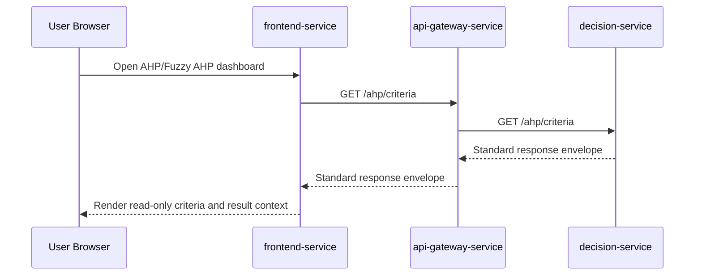

# SentiRank Microservice Architecture

## Purpose

This document defines the current thesis-stage microservice architecture for SentiRank, a Spotify Google Play review analysis project using IndoBERT, SVM, AHP, and Fuzzy AHP.

It is the canonical reference for active runtime boundaries, data ownership, persistence, local Docker orchestration, and deployment modes. Historical extraction notes remain in milestone-specific documents.

## Current Architecture Assessment

The active runtime is split into an API Gateway and five domain services under `services/`. They run as separate FastAPI processes and communicate over HTTP. The Next.js frontend uses the API Gateway as its only backend entry point.

`ml-service/` is no longer the primary runtime layer. Its scripts, notebooks, quality audits, model utilities, and tests remain active for research reproducibility. `ml-service/app/` is legacy pre-extraction experiment runtime code and must not be treated as the frontend-facing backend.

This is a thesis-stage implementation, not a claim of production-grade distributed-system maturity. Shared read-only research artifact mounts and optional local model files remain deliberate constraints.

## Data Source Policy

SentiRank uses two separate data paths. This distinction is intentional and must be preserved during the thesis-stage microservice refactor.

### Research Artifact Path

CSV, JSON, model, and report snapshot artifacts are allowed for reproducible research outputs, including:

- scraped review datasets
- preprocessing batch outputs
- labeling outputs
- SVM and IndoBERT evaluation metrics
- model evaluation summaries
- AHP outputs
- Fuzzy AHP outputs
- ranking comparison outputs
- dashboard or report snapshots derived from research outputs

These artifacts are read-only for runtime services, reproducible outputs from the thesis experiment pipeline, and versioned as research evidence. They are not interactive user runtime data and do not need to be migrated wholesale into the database for this milestone.

### Runtime Database Path

The database is reserved for user-facing runtime data, especially:

- user-submitted review text
- sentiment inference result
- aspect or criteria classification result
- confidence or probability values when available
- model version used for inference
- prediction source
- `created_at` timestamp
- inference history

As of MS-12A, `api-gateway-service` exposes runtime review inference endpoints that call `sentiment-service` and `aspect-service`, then persist the combined result to the runtime database. The database remains an inference-history store only, not the source of truth for research CSV/JSON artifacts.

### Frontend Data Access

The frontend must call only `api-gateway-service` through `NEXT_PUBLIC_API_BASE_URL`. Frontend code must not read CSV/JSON artifacts directly, call internal service ports `8001` through `8005`, or calculate AHP/Fuzzy AHP locally. It displays only data returned by gateway-backed services and explicit unavailable or empty states when the gateway is unavailable.

### Acceptable File-Based Runtime Reads

Some backend services may read CSV/JSON artifacts during runtime for demo, report, and thesis-result presentation as long as all of the following remain true:

- files are treated as read-only research artifacts
- ownership is clear by service domain
- frontend does not read files directly
- API Gateway remains the frontend entry point
- the service does not present static artifact data as live user-generated runtime data

This policy avoids unnecessary database migration while keeping the architecture academically defensible: reproducible research evidence stays artifact-based, while interactive user runtime data belongs in the database.

## Current Runtime Topology

| Service name | Responsibility | Port | Owner/domain | Active source/artifact boundary | Status |
| --- | --- | ---: | --- | --- | --- |
| `frontend-service` | Next.js user interface and dashboard views | 3000 | Presentation | `frontend/` | Active; optional Compose profile |
| `api-gateway-service` | Public API entry point, CORS, routing, health aggregation, runtime inference orchestration, inference-history repository | 8000 | API Gateway | `services/api-gateway/` | Active |
| `review-service` | Review dataset metadata, scraping summaries, preprocessing summaries, review samples | 8001 | Review/data domain | service code plus read-only review artifacts | Active |
| `sentiment-service` | IndoBERT inference, sentiment summaries, and evaluation | 8002 | Sentiment domain | service code, evaluation artifacts, local/Hugging Face model | Active |
| `aspect-service` | SVM inference, aspect summaries, and evaluation | 8003 | Aspect domain | service code, evaluation artifacts, local SVM model | Active |
| `decision-service` | AHP, Fuzzy AHP, criteria, expert judgement processing, weighting, ranking comparison calculations | 8004 | Decision-support domain | service-owned schemas and calculation modules | Active |
| `report-service` | Read-only aggregation for Dashboard, evaluation, and ranking-comparison views | 8005 | Reporting domain | research output summaries across `datasets/outputs/eda` | Active; kept in MS-13D |
| `database-service` | Optional PostgreSQL infrastructure for API Gateway inference-history persistence | 5432 | Persistence infrastructure | deployment-like runtime history storage; not a research artifact warehouse | Optional Compose profile |

## Service Dependency Flow

The frontend must call only the API Gateway. The API Gateway routes requests to internal services. Internal services can communicate over HTTP when a domain dependency is required. Research artifacts are mounted or read behind service ownership boundaries; they are not frontend data sources.





## Service Responsibility Boundaries

### frontend-service

Owns user interface rendering, dashboard navigation, client-side state for UI interactions, and presentation components. It must use `NEXT_PUBLIC_API_BASE_URL` for browser-facing API access and may use `API_GATEWAY_INTERNAL_URL` only for server-side/Docker gateway routing. It does not own ML logic, AHP/Fuzzy AHP calculation, direct internal service URLs, CSV/JSON file reads, database access, or service orchestration.

### api-gateway-service

Owns the public API boundary. It handles CORS, route forwarding, response envelope standardization, public error mapping, service health aggregation, and runtime review inference orchestration. For runtime review inference, it calls `sentiment-service` and `aspect-service`, persists the combined result, and returns the saved history record. It does not own domain model calculations, dataset transformation, research artifact parsing, frontend rendering, or bulk research artifact persistence.

### review-service

Owns review dataset metadata, scraping summaries, preprocessing summaries, and review samples. It may read review-domain CSV/JSON artifacts from `datasets/raw`, `datasets/processed`, and early EDA outputs as read-only research evidence. It does not own sentiment prediction, aspect classification, AHP/Fuzzy AHP calculation, or report-level interpretation.

### sentiment-service

Owns sentiment model metadata, summaries, evaluation, and inference. The selected model is IndoBERT `run_3_weighted_loss_lr_1e-5`, loaded from a Git-ignored local artifact or configured Hugging Face model id. If loading fails, responses identify fallback mode explicitly through provenance fields; fallback is not represented as real model inference. It does not own aspect classification, review scraping, AHP/Fuzzy AHP calculation, or frontend rendering.

### aspect-service

Owns aspect classification metadata, summaries, evaluation, and inference. The selected classifier is the merged five-class SVM. Real model serving is enabled when the local artifact loads; fallback is explicit when it does not. Because the selected pipeline may not expose `predict_proba`, model confidence can be `null`. It does not own sentiment inference, AHP/Fuzzy AHP weighting, report aggregation, or frontend rendering.

### decision-service

Owns AHP, Fuzzy AHP, criteria, expert judgement processing, weighting, and ranking comparison calculation behavior. The frontend displays read-only results and does not expose a calculation button. Current ranking artifacts remain sample/development outputs until validated expert judgement forms are collected and processed. It does not own ML inference, review data acquisition, report aggregation, frontend rendering, or direct frontend access.

### report-service

Owns read-only aggregation for Dashboard, evaluation, and ranking-comparison views. It may read consolidated research output CSV/JSON artifacts and may call review, sentiment, aspect, and decision services through internal APIs when needed. It does not own the underlying model inference, review acquisition, decision calculation implementations, frontend Reports routing, or printable report/export features.

MS-13D decision: keep `report-service` as an active dashboard aggregation service. The removed frontend Reports page/menu does not make this backend service obsolete because Dashboard, Model Evaluation, and AHP/Fuzzy AHP still consume API Gateway routes backed by `report-service`, especially `GET /evaluation/summary` and `GET /reports/ranking-comparison`.

### database-service

Provides optional PostgreSQL infrastructure only. The API Gateway repository owns runtime persistence behavior and defaults to SQLite for local/demo use. PostgreSQL is optional for deployment; neither mode stores every research CSV/JSON artifact.

## Communication Strategy

- External communication is browser to frontend, then frontend to API Gateway.
- Frontend uses `NEXT_PUBLIC_API_BASE_URL=http://localhost:8000`.
- Frontend must not know internal service ports.
- API Gateway communicates with internal services over HTTP REST.
- All services return the standard response envelope:

```json
{
  "success": true,
  "message": "...",
  "data": {}
}
```

## Docker and Network Strategy

The target deployment uses one Docker Compose network. Containers communicate by service name rather than localhost.

Example internal service URLs:

- `http://decision-service:8004`
- `http://review-service:8001`
- `http://sentiment-service:8002`
- `http://aspect-service:8003`
- `http://report-service:8005`

The API Gateway is the only backend service exposed to the frontend for API access.

As of MS-13F, the local/demo Docker default is backend-focused:

- `docker compose up --build` starts the backend microservices with SQLite runtime inference persistence.
- `docker compose --profile frontend up --build` also starts the optional Next.js container.
- `docker compose --profile postgres up --build` starts the optional PostgreSQL container for deployment-like runs when `API_GATEWAY_DATABASE_URL` points to `database-service`.

Frontend deployment is intentionally separate from backend Compose. A local full demo can use local frontend development or the optional frontend profile, SQLite, and local/Hugging Face model sources. A semi-online demo can use Vercel pointing to a tunneled local API Gateway with local SQLite. A full online deployment, if required, can use Vercel plus containerized backend services, managed PostgreSQL, and a private Hugging Face or platform-managed model artifact.

## Database Strategy

The database is for runtime user inference history, not for bulk research artifact migration. Acceptable runtime records include user-submitted text, sentiment result, aspect/criteria result, confidence/probability, model version, prediction source, timestamp, and inference history.

For the thesis-stage implementation, one shared database-service is sufficient if runtime persistence is needed. Domain separation can be handled through schema or table ownership. Database-per-service is future work, not a requirement for MS-10C.

MS-13E removed the legacy Prisma schema/config artifacts. Runtime inference history remains implemented by `api-gateway-service` repository persistence with SQLite as the local/demo default and PostgreSQL optional for deployment. MS-13F keeps PostgreSQL behind an optional Compose profile. Do not interpret the Compose PostgreSQL service as a requirement to migrate all CSV/JSON research outputs into relational tables.

## Legacy Boundary Status

The extraction sequence is complete for the active runtime: decision, gateway, review, sentiment, aspect, and report responsibilities now live under `services/`. MS-12A also added API Gateway runtime inference orchestration and history persistence.

Keep `ml-service/` for research pipelines, notebooks, quality audits, model export utilities, and tests. Treat `ml-service/app/` as legacy experiment runtime code until a separate removal audit confirms no research or test dependency remains. It must not be wired back into the frontend path.

## Current Runtime Audit

The MS-10C audit found the following current behavior:

- `review-service` reads CSV/JSON artifacts from `datasets/raw`, `datasets/processed`, and `datasets/outputs/eda/01_data_acquisition` plus `02_preprocessing`.
- `sentiment-service` reads JSON artifacts from `datasets/outputs/eda/03_indobert`, `datasets/outputs/eda/05_evaluation`, and sentiment distribution outputs.
- `aspect-service` reads JSON and CSV artifacts from `datasets/outputs/eda/04_svm` and `datasets/outputs/eda/05_evaluation`.
- `report-service` reads JSON and CSV artifacts across `03_indobert`, `04_svm`, `05_evaluation`, `06_ahp`, `07_fuzzy_ahp`, and `08_ranking_comparison`.
- `decision-service` currently owns calculation behavior and static criteria in code; it does not read research CSV/JSON artifacts.
- `api-gateway-service` proxies to internal services and does not parse research artifacts directly.
- `frontend-service` calls gateway routes through `NEXT_PUBLIC_API_BASE_URL`/`API_GATEWAY_INTERNAL_URL` and no direct frontend calls to internal ports `8001` through `8005` were found.
- Database runtime inference history is active for `POST /inference/review` and `GET /inference/history` through `api-gateway-service`; research CSV/JSON artifacts remain file-based.

Risk note: multiple extracted services currently depend on the shared `datasets/` artifact folder. This is acceptable for the thesis-stage reporting/demo scope because mounts are read-only and ownership is documented, but stronger domain-owned artifact packaging should be considered before claiming production-grade maturity.

## Why This Qualifies as Microservice Architecture

The current thesis-stage runtime qualifies as a microservice architecture because it has:

- independent deployable service boundaries
- separate runtime processes per domain
- API-based communication between services
- API Gateway as the single public entry point
- domain-based service separation
- Docker-based deployment topology
- internal services hidden from the frontend

These boundaries are implemented, but the repository should not be described as production-ready without the operational controls listed below.

## Limitations

This is a thesis-stage implementation. It does not yet implement all production-grade distributed-system concerns, and full online deployment has not been claimed as completed.

Future work may include:

- service discovery
- distributed tracing
- message broker or event-driven workflows
- migrating selected research summaries into PostgreSQL only when query patterns justify it
- stronger schema/domain ownership for runtime persistence
- database-per-service
- migration and seed pipeline for final thesis demo data
- centralized logging
- circuit breakers and retry policies
- production secret management
- horizontal autoscaling
- validated expert judgement collection and replacement of sample AHP/Fuzzy AHP outputs

These are valid future improvements but are not required for the current thesis demo.
